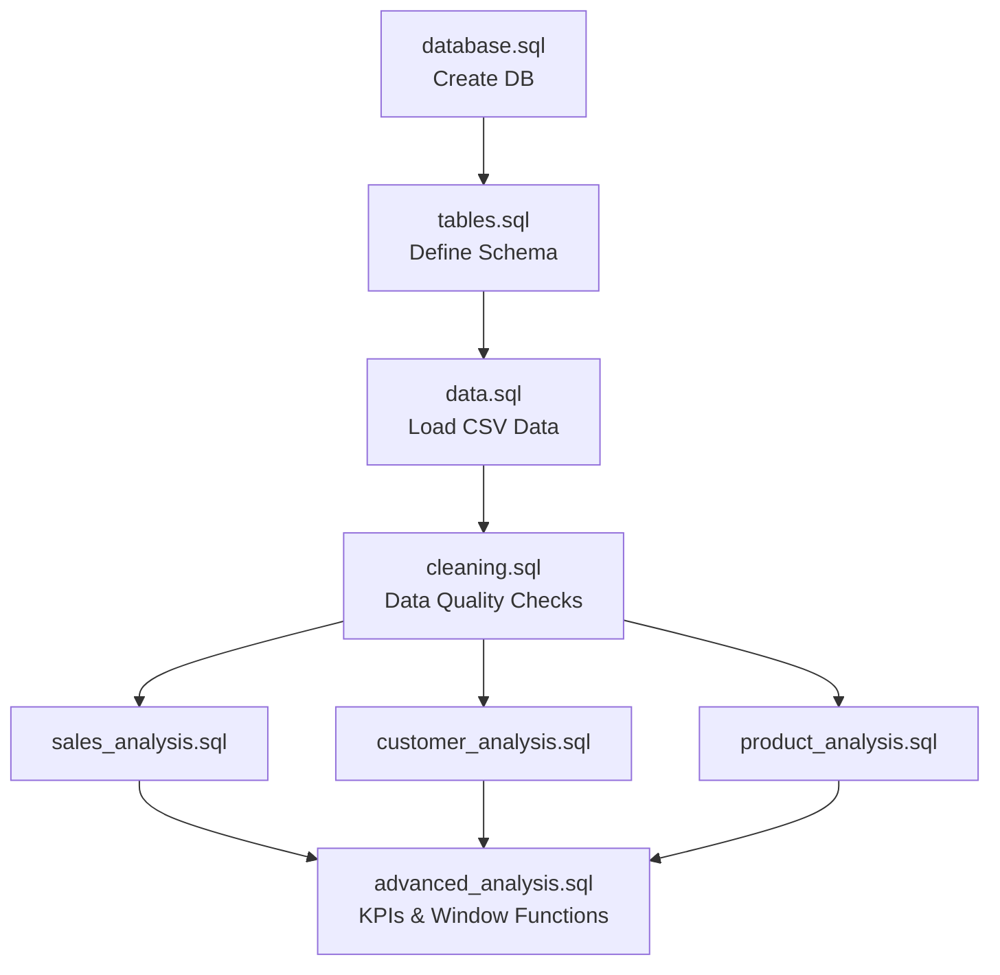

# E-Commerce Sales Analysis Using MySQL


> A SQL-based data analysis portfolio project exploring e-commerce sales data to uncover actionable insights about revenue, customers, products, and trends.

---

## 📌 Business Problem

An e-commerce company needs to evaluate its business performance. Key questions include:

- **Revenue & Profit:** How much are we generating, and where is our profit coming from?
- **Products:** Which products and categories drive the most sales?
- **Customers:** Who are our most valuable customers, and are they returning?
- **Trends:** Which regions perform best, and how is revenue trending month-over-month?

**Goal:** Use SQL to analyze transactional data and generate actionable business intelligence.

---

## Objectives

1. Design a relational database for e-commerce transactions
2. Populate it with realistic sample data
3. Perform data quality checks before analysis
4. Answer business questions using SQL queries
5. Calculate key performance indicators (KPIs)
6. Identify meaningful patterns and insights

---

## Project Execution Flow

This project follows a structured lifecycle from database creation to advanced analytics. The flow below illustrates how the different SQL scripts interact:



---

## Database Schema

The database contains **5 tables** with the following relationships:

```
categories (1) ──< (many) products
                              │
customers (1) ──< (many) orders (1) ──< (many) order_items (many) >── (1) products
```

### Table Descriptions

| Table | Rows | Description |
|-------|------|-------------|
| `categories` | 30 | Product categories (Electronics, Clothing, Books, etc.) |
| `products` | 25 | Products with selling price and cost price |
| `customers` | 500 | Customers with name, email, city, state, and registration date |
| `orders` | ~500 | Purchase transactions with date and status (Completed/Cancelled/Returned) |
| `order_items` | ~1000 | Individual product lines within orders (quantity, price, discount) |

### Data Dictionary

#### `categories`
| Column | Type | Description |
|--------|------|-------------|
| `category_id` | INT | Primary Key. Unique ID for each category. |
| `category_name` | VARCHAR(50) | Name of the category. |

#### `products`
| Column | Type | Description |
|--------|------|-------------|
| `product_id` | INT | Primary Key. Unique ID for each product. |
| `product_name` | VARCHAR(100) | Name of the product. |
| `category_id` | INT | Foreign Key referencing `categories.category_id`. |
| `price` | DECIMAL(10,2) | Selling price of the product. |
| `cost` | DECIMAL(10,2) | Cost price of the product. |

#### `customers`
| Column | Type | Description |
|--------|------|-------------|
| `customer_id` | INT | Primary Key. Unique ID for each customer. |
| `first_name` | VARCHAR(50) | Customer's first name. |
| `last_name` | VARCHAR(50) | Customer's last name. |
| `email` | VARCHAR(100) | Customer's email address. |
| `city` | VARCHAR(50) | City of residence. |
| `state` | VARCHAR(50) | State of residence. |
| `registration_date`| DATE | Date the customer signed up. |

#### `orders`
| Column | Type | Description |
|--------|------|-------------|
| `order_id` | INT | Primary Key. Unique ID for each order. |
| `customer_id` | INT | Foreign Key referencing `customers.customer_id`. |
| `order_date` | DATE | Date the order was placed. |
| `status` | VARCHAR(20) | Order status (e.g., Completed, Cancelled, Returned). |

#### `order_items`
| Column | Type | Description |
|--------|------|-------------|
| `order_item_id` | INT | Primary Key. Unique ID for each line item. |
| `order_id` | INT | Foreign Key referencing `orders.order_id`. |
| `product_id` | INT | Foreign Key referencing `products.product_id`. |
| `quantity` | INT | Number of units purchased. |
| `unit_price` | DECIMAL(10,2) | Price per unit at the time of purchase. |
| `discount` | DECIMAL(4,2) | Discount applied to the item. |

### Key Relationships

- **One category → many products**: "Electronics" contains Headphones, Charger, etc.
- **One customer → many orders**: A customer can buy multiple times
- **One order → many order_items**: One purchase can include multiple products
- **One product → many order_items**: The same product can appear in many orders

### Why `order_items` exists separately from `orders`

One order can contain multiple products. If we stored products inside the `orders` table, we'd duplicate the order date, customer ID, and status for every product in that order. The `order_items` table stores product-level details (what was bought, how many, at what price), while `orders` stores order-level details (who bought it, when, order status).

### Revenue Formula

```
line_revenue = quantity × unit_price × (1 - discount)
```

Revenue is calculated from `order_items`, NOT from `products.price`, because `unit_price` captures the actual price at the time of purchase (prices may change over time).

---

## SQL Concepts Used

### Basic SQL
- `SELECT`, `WHERE`, `ORDER BY`, `GROUP BY`, `HAVING`
- Aggregate functions: `COUNT`, `SUM`, `AVG`, `MIN`, `MAX`
- `JOIN` (INNER JOIN, LEFT JOIN)
- `CASE` statements
- `ROUND`, `CONCAT`, `DATE_FORMAT`

### Advanced SQL
- **CTEs** (Common Table Expressions) — break complex queries into readable steps
- **Subqueries** — nested queries for multi-step calculations
- **Window Functions:**
  - `RANK()` — rank with gaps on ties
  - `DENSE_RANK()` — rank without gaps on ties
  - `ROW_NUMBER()` — unique sequential numbering
  - `LAG()` — access previous row's value (month-over-month comparison)
  - `LEAD()` — access next row's value
  - Window `SUM()` — running/cumulative totals
  - Window `AVG()` — moving averages
- `PARTITION BY` — group rows for window functions without collapsing them

---

## Business Questions Answered

### Sales Analysis (`sales_analysis.sql`)
1. What is the total revenue?
2. How many orders were placed (by status)?
3. What is the average order value?
4. How many total units were sold?
5. What is the total estimated profit?
6. What is the monthly revenue trend?
7. What is the quarterly revenue?
8. What are the top 10 highest-value orders?
9. What is the average discount given?
10. What is the revenue breakdown by order status?

### Customer Analysis (`customer_analysis.sql`)
1. How many registered customers do we have?
2. How many customers actually placed orders?
3. Which customers never placed an order?
4. How many orders does each customer have?
5. Who are the top 10 customers by revenue?
6. How many repeat customers are there?
7. What is the repeat customer rate?
8. What is the average revenue per customer?
9. Which states generate the most revenue?
10. Which cities generate the most revenue?
11. What is the customer purchase frequency distribution?

### Product Analysis (`product_analysis.sql`)
1. Which products sold the most units?
2. Which products generated the most revenue?
3. Which products are the most profitable?
4. Which products are the lowest sellers?
5. Which products have never been sold?
6. Revenue by category
7. Profit by category
8. Products with high revenue but low profit margin
9. Average selling price vs. list price by category
10. Number of products per category

### Advanced Analysis (`advanced_analysis.sql`)
1. Month-over-month revenue change (LAG)
2. Rank customers by revenue (RANK)
3. Rank products within each category (DENSE_RANK + PARTITION BY)
4. Identify repeat customers with order history (subquery)
5. Customer segmentation by spending (CASE + CTE)
6. Most recent order per customer (ROW_NUMBER)
7. Running total of monthly revenue (window SUM)
8. Compare with next month's revenue (LEAD)
9. 3-month moving average revenue (window AVG)
10. Category contribution to total revenue (percentage)
11. KPI Dashboard — all key metrics in one query

---

## Data Quality Checks (`cleaning.sql`)

Before analysis, the following checks are performed:

| Check | What It Detects |
|-------|----------------|
| NULL values | Missing data in critical columns |
| Duplicate records | Duplicate emails, duplicate items per order |
| Invalid quantities | Quantities ≤ 0 |
| Invalid prices | Prices or costs ≤ 0 |
| Invalid discounts | Discounts < 0 or ≥ 100% |
| Future dates | Order dates in the future |
| Order before registration | Orders placed before customer signed up |
| Orphan records | Orders/items referencing non-existent customers/products |
| Unexpected statuses | Statuses other than Completed/Cancelled/Returned |
| Negative margin products | Products where cost ≥ price |

---

## Key Performance Indicators (KPIs)

| KPI | Formula |
|-----|---------|
| Total Revenue | `SUM(quantity × unit_price × (1 - discount))` for completed orders |
| Total Orders | `COUNT(DISTINCT order_id)` for completed orders |
| Total Customers | `COUNT(DISTINCT customer_id)` from orders |
| Average Order Value | `Total Revenue / Total Orders` |
| Total Units Sold | `SUM(quantity)` for completed orders |
| Repeat Customer Rate | `Customers with > 1 order / Total customers who ordered × 100` |
| Estimated Profit | `SUM(quantity × (unit_price × (1-discount) - cost))` |
| Profit Margin | `Total Profit / Total Revenue × 100` |

---

## Key Insights

> **Note:** Run all the analysis SQL files against the database to view the actual results. The insights below are based on the patterns built into the sample data.

1. **Seasonal Revenue Spike**: October–December 2023 shows significantly higher order volume compared to other periods, reflecting a festive season pattern.

2. **Top Customers Drive Significant Revenue**: The top 5 customers by order frequency contribute a disproportionate share of total revenue, illustrating the Pareto principle.

3. **High Repeat Customer Rate**: The majority of customers who placed an order are repeat buyers (more than 1 order), indicating strong customer retention.

4. **Product Popularity Concentration**: A subset of 10 products (across Electronics, Clothing, Beauty, and Food categories) accounts for the majority of units sold.

5. **Revenue vs. Profit Disconnect**: Some high-revenue products have lower profit margins due to high costs, while some lower-revenue products generate better profit margins.

6. **Regional Concentration**: Maharashtra, Karnataka, and Delhi are the top revenue-generating states, driven by a higher concentration of customers.

7. **Revenue Growth Trajectory**: Monthly revenue shows an overall upward trend from 2023 into 2024, with seasonal fluctuations.

---

## Project Structure

```
ecommerce-sql-analysis/
├── sql/
│   ├── database.sql           — Creates the MySQL database
│   ├── tables.sql             — Creates all 5 tables with keys and constraints
│   ├── data.sql               — Inserts sample data (500 customers, ~500 orders)
│   ├── cleaning.sql           — Data quality checks (10 types of validation)
│   ├── sales_analysis.sql     — Revenue, orders, trends analysis (10 queries)
│   ├── customer_analysis.sql  — Customer behavior analysis (11 queries)
│   ├── product_analysis.sql   — Product & category analysis (10 queries)
│   └── advanced_analysis.sql  — CTEs, window functions, KPIs (11 queries)
├── README.md
└── .gitignore
```

---

## How to Run This Project

### Prerequisites
- MySQL 8.0 or higher installed
- VS Code with a MySQL extension (like "MySQL" by Weijan Chen or "Database Client") OR MySQL command-line client

### Method 1: Using VS Code (Recommended for Interviews)

This is the easiest way to view and present your data directly inside your editor.

1. **Clone the repository and open in VS Code**
   ```bash
   git clone https://github.com/minendra1/ecommerce-sql-analysis.git
   ```
   Open the `ecommerce-sql-analysis` folder in VS Code.

2. **Connect to your Database**
   - Click on the database/SQL extension icon in the left sidebar of VS Code.
   - Add a new connection using your local credentials (Host: `127.0.0.1`, User: `root`, Password: `<your_password>`).
   - Leave the "Database" field empty for now and click **Connect**.

3. **Run Setup Scripts (In Order)**
   Open the following files one by one. For each file, highlight all the text, right-click, and select **"Run MySQL Query"**:
   1. `sql/database.sql` (Creates the database)
   2. `sql/tables.sql` (Creates the table structures)
   3. `sql/data.sql` (Loads the CSV data into the tables)

4. **Set Default Database**
   - Now that the database is created, right-click your connection in the left sidebar and select **Edit Connection**.
   - In the "Database" field, type `ecommerce_analysis` and save.

5. **Run Analysis Queries**
   - Open any analysis file (e.g., `sql/advanced_analysis.sql`).
   - Highlight a specific query, right-click, and select **"Run MySQL Query"**.
   - The results will appear in a formatted table on your screen.

---

### Method 2: Using the Command Line (PowerShell)

If you prefer to run everything from the terminal with a single command:

1. **Clone the repository**
   ```bash
   git clone https://github.com/minendra1/ecommerce-sql-analysis.git
   cd ecommerce-sql-analysis
   ```

2. **Run all setup scripts in one command**
   ```powershell
   Get-Content sql\database.sql, sql\tables.sql, sql\data.sql | & "C:\Program Files\MySQL\MySQL Server 8.0\bin\mysql.exe" --local-infile=1 -u root -p
   ```
   *(Enter your password when prompted)*

3. **Run analysis queries**
   You can now open the MySQL shell and source the analysis files:
   ```bash
   & "C:\Program Files\MySQL\MySQL Server 8.0\bin\mysql.exe" -u root -p
   ```
   ```sql
   USE ecommerce_analysis;
   source sql/sales_analysis.sql;
   ```

---

## Technologies Used

- **MySQL 8.0** — Relational database management system
- **SQL** — Query language for data analysis
- **Git & GitHub** — Version control and code hosting

---

## Author

**Minendra**

This project was built as a Data Analyst portfolio project to demonstrate SQL querying, data analysis, and business insight generation skills.
